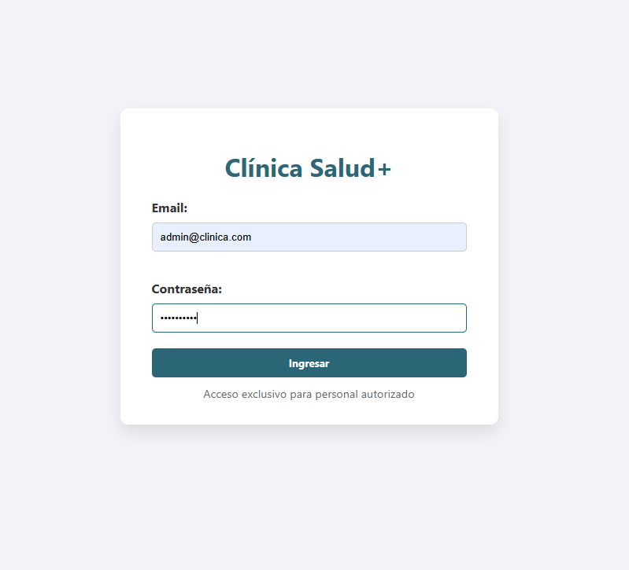
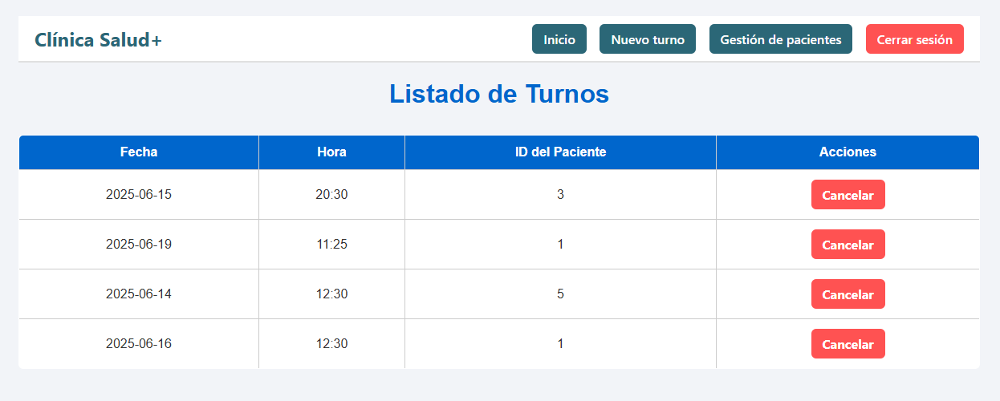
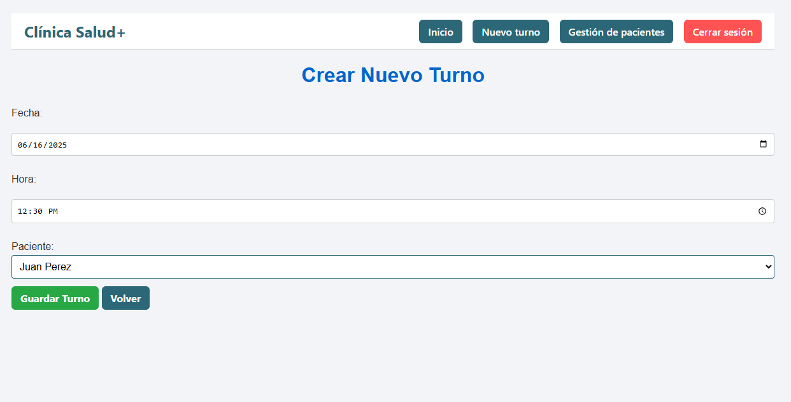
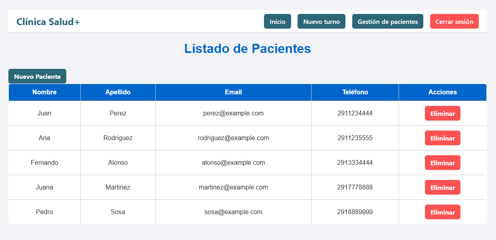
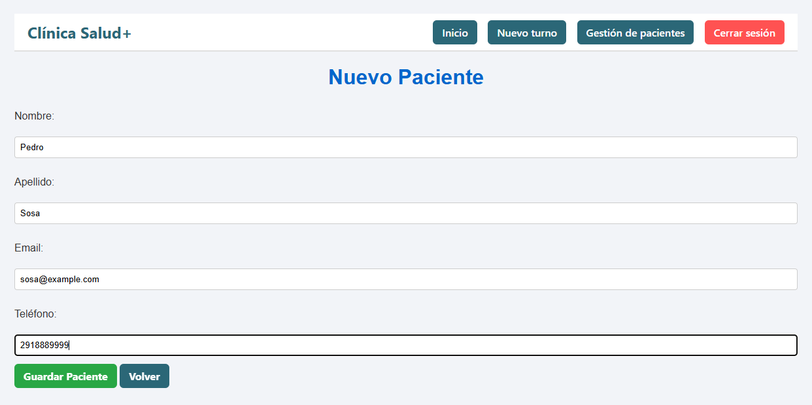
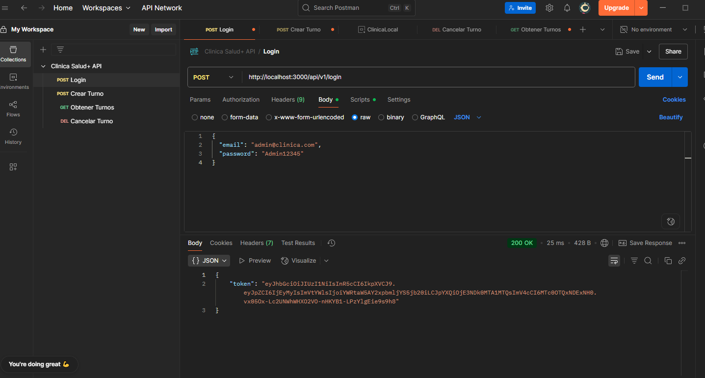
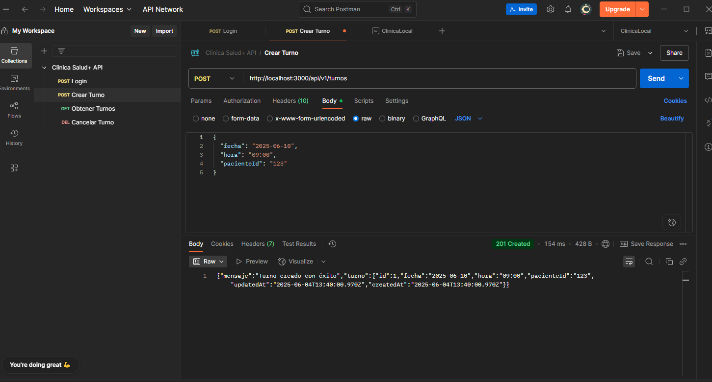
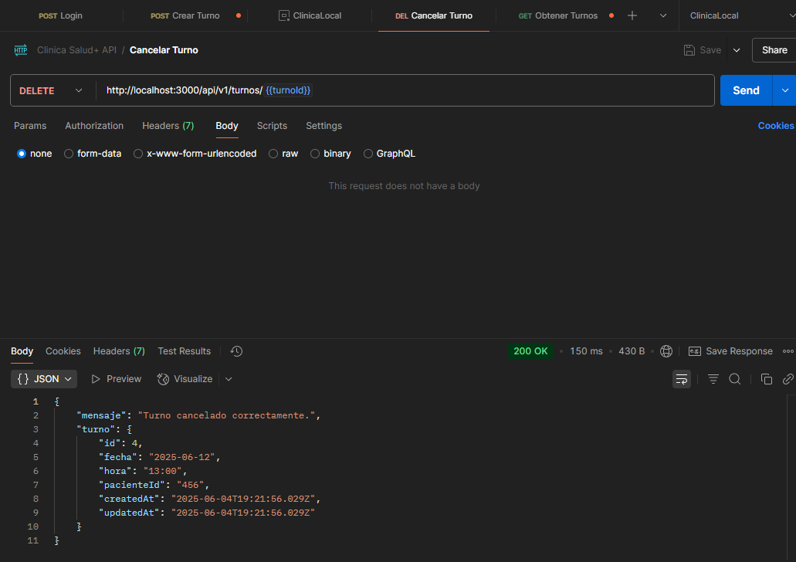

# Clínica Salud+ - Sistema de Gestión de Turnos

Trabajo Práctico Nº3: sistema de gestión de turnos y pacientes para la Clínica Salud+.

El sistema permite visualizar y cancelar turnos, registrar, gestionar pacientes, realizar login de administrador y validar datos con seguridad en la API y tambien en la versión local.

---

## 🚀 Instalación del proyecto

1. **Clonar el repositorio**
   ```bash
   git clone https://github.com/lucianoParrotta/practico3progra3.git
   cd practico3progra3
   ```

2. **Instalar dependencias**
   ```bash
   npm install
   ```

3. **Ejecutar el servidor**
   ```bash
   npm start
   ```

El servidor se iniciará en `http://localhost:3000/`

---

## Credenciales de acceso (versión local)

- **Email:** `admin@clinica.com`
- **Contraseña:** `Admin12345`

---

## Endpoints

### Autenticación (API)
| Método | Ruta              | Descripción               |
|--------|-------------------|---------------------------|
| POST   | `/api/v1/login`   | Inicia sesión (devuelve JWT) |

### Turnos (API REST)
| Método | Ruta                         | Descripción                          |
|--------|------------------------------|--------------------------------------|
| GET    | `/api/v1/turnos/:idPaciente` | Listar turnos por paciente           |
| POST   | `/api/v1/turnos`             | Crear nuevo turno (requiere JWT)     |
| DELETE | `/api/v1/turnos/:idTurno`    | Cancelar turno por ID (requiere JWT) |

### Pacientes (API REST)
| Método | Ruta                   | Descripción         |
|--------|------------------------|---------------------|
| GET    | `/api/v1/pacientes`    | Listar pacientes    |
| POST   | `/api/v1/pacientes`    | Crear nuevo paciente |

### Versión Local (con vistas EJS)
| Ruta                     | Descripción                    |
|--------------------------|--------------------------------|
| `/login`                 | Formulario de inicio de sesión |
| `/local/turnos`          | Lista de turnos (protegida)    |
| `/local/turnos/nuevo`    | Crear nuevo turno              |
| `/local/pacientes`       | Listado de pacientes           |
| `/local/pacientes/nuevo` | Crear nuevo paciente           |

---

## Capturas de pantalla

### Login


### Listado de Turnos


### Nuevo Turno


### Gestión de Pacientes


### Nuevo Paciente


---

## Pruebas de la API con Postman

### Login con credenciales válidas
Se realiza un `POST` a `/api/v1/login` con email y contraseña válidos, y se recibe un token JWT.



### Crear nuevo turno con token JWT
Se realiza un `POST` a `/api/v1/turnos` con un token válido en el header y datos válidos en el body.



### Obtener turnos por paciente
Se realiza un `GET` a `/api/v1/turnos/:idPaciente` para obtener todos los turnos asociados.


### Cancelar turno existente
Se realiza un `DELETE` a `/api/v1/turnos/:idTurno` con token en el header.



---

## Tecnologías utilizadas

- **Node.js** + **Express**
- **EJS** + **ejs-mate** para plantillas dinámicas con layout
- **Sequelize** con **SQLite**
- **JWT** para la API
- **Express-Session** para login en la versión local
- **Joi** para validación de datos
- **Method-Override** para soportar DELETE/PUT desde formularios HTML
- **Morgan** para registrar solicitudes HTTP en consola
- **Dotenv** para gestionar variables de entorno desde `.env`
- **Postman** para probar los endpoints
- **HTML + CSS** para interfaz amigable

---

## Funcionalidades principales

- Crear, listar y eliminar turnos (API y vista local)
- Login de administrador con validación
- Gestión completa de pacientes
- Validación con Joi
- Diseño visual amigable para el usuario
- Barra de navegación

---

## Integrantes

- Proyecto desarrollado por Luciano Parrotta. 
    Materia: **Programación III**